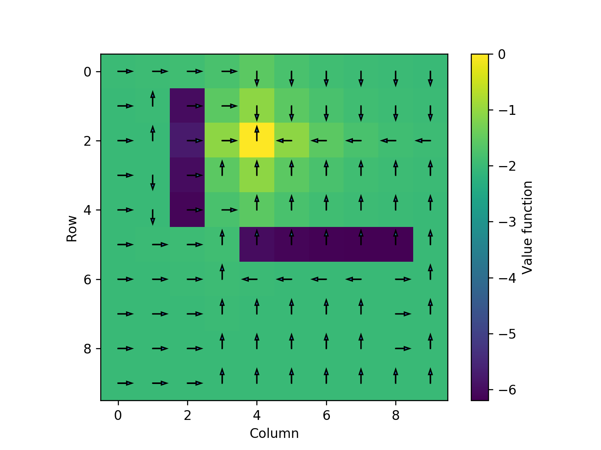
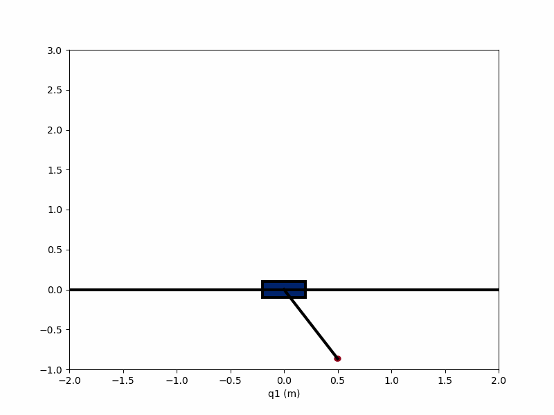

# Underactuated-Robotics

Gridworld optimization

Robot path determined by using Dynamic Programming and Markov Decision Process

Energy shaping

Controlling a cartpole to stabilize at upright position using energy shaping 

